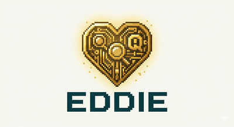

# Eddie

<p align="center">
  
</p>

**Your site's shipboard computer.**

Semantic search and Q&A for static sites — fully client-side, no server required. Runs entirely in your visitor's browser via WebAssembly, which is a bit like using a starship computer to find your keys, but honestly, it works brilliantly.

> *"I'm just so happy to be doing this for you."*
> — Eddie, the Heart of Gold's shipboard computer

## Don't Panic

Eddie does three things, and does them with a Genuine People Personality:

1. **Build time:** A CLI reads your markdown/HTML content, chunks it, and generates embeddings using a sentence-transformer model. The result is a compact binary index shipped as a static asset. Simple, elegant, like a fjord.

2. **Runtime:** A WASM module in the browser downloads the same embedding model (from HuggingFace CDN, cached after first use), embeds the visitor's query, and performs hybrid semantic + keyword search against the pre-built index.

3. **Optional Q&A:** On browsers with WebGPU support, a small language model synthesizes a short answer from retrieved content — like having a Babel Fish for your documentation, except it translates *meaning* instead of languages. Falls back gracefully to search-only on browsers without WebGPU.

## Quick Start

### 1. Index your content

```bash
eddie index --content-dir content/ --output static/eddie-index.bin
```

### 2. Embed the widget

```html
<script src="/eddie-widget.js"></script>
```

### 3. Share and Enjoy

Visitors see a floating search button. First search triggers a one-time model download (~23MB), then searches are instant. The answer to how long subsequent queries take is not 42 — it's closer to 42 milliseconds.

## How It Compares

Every tool with Q&A requires a server. Every client-side tool is keyword-only. Eddie does both.

| Tool | Deployment | Search | Q&A | Server | Cost |
|------|-----------|--------|-----|--------|------|
| **Eddie** | Client (WASM) | Hybrid semantic + BM25 | Yes (WebGPU) | No | Free |
| Pagefind | Client (WASM) | Keyword | No | No | Free |
| Algolia DocSearch | Cloud | Keyword + neural | No | Yes | Free for OSS |
| kapa.ai | Cloud | Semantic (RAG) | Yes | Yes | Enterprise |
| DocsBot | Cloud | Semantic (RAG) | Yes | Yes | $16–$416/mo |

## Configuration

Create `eddie.toml` in your site root (optional — defaults are carefully chosen, unlike Marvin's personality):

```toml
[embedding]
model = "sentence-transformers/all-MiniLM-L6-v2"

[qa]
enabled = true
runtime = "webllm"
model = "HuggingFaceTB/SmolLM2-1.7B-Instruct"

[widget]
theme = "auto"
position = "bottom-right"
```

### Embedding Model Alternatives

The default model (`all-MiniLM-L6-v2`) is Apache 2.0 but was trained on MS MARCO data with non-commercial restrictions. Models are fetched from HuggingFace CDN at runtime — Eddie doesn't redistribute model weights. If training data provenance matters to you:

| Model | License | Params |
|-------|---------|--------|
| `BAAI/bge-small-en-v1.5` | MIT | 33M |
| `Snowflake/snowflake-arctic-embed-s` | Apache 2.0 | 33M |
| `nomic-ai/modernbert-embed-base` | Apache 2.0 | 110M |

## How It Works

Eddie is a single Rust codebase that compiles to two targets — one might say it's *improbably* versatile:

1. **Native CLI** (`eddie`) — runs at build time to index your content
2. **WASM module** — runs in the browser for search and embedding

The indexing pipeline:

```
Markdown/HTML → parse → chunk → embed (MiniLM, 384-dim) → BM25 index → serialize → index.bin
```

The search pipeline (browser):

```
Query → download model (first use) → embed query → cosine similarity + BM25 → RRF fusion → ranked results
```

ML inference uses [Candle](https://github.com/huggingface/candle) (HuggingFace's Rust ML framework), which compiles to WASM without complaint. This is neural network inference running in a browser to search a blog — far more intelligent than the task demands, which Eddie would tell you is *exactly how he likes it*.

## GitHub Actions

```yaml
- name: Index content
  run: |
    curl -L https://github.com/jt55401/eddie/releases/latest/download/eddie-linux-amd64 -o eddie
    chmod +x eddie
    ./eddie index --content-dir content/ --output public/eddie-index.bin
```

## Project Layout

```
src/           Rust source (CLI + WASM shared core)
requirements/  Requirements-as-code
docs/plans/    Design documents
```

## Requirements

This project uses [requirements-as-code](https://github.com/jt55401/requirements-skill). See [requirements.md](requirements.md) for the full requirements tree.

## Contributing

See [CONTRIBUTING.md](CONTRIBUTING.md). Pull requests welcome — just don't ask Eddie to be less cheerful about it.

## License

GPL-3.0-only. See [LICENSE](LICENSE).

Copyright (c) 2026 Jason Grey. Project name and branding are not licensed under GPL — see [TRADEMARKS.md](TRADEMARKS.md).

## Support

If you find Eddie useful, use the GitHub Sponsor button on the repository.

For commercial integration or support, [Improbability Engineers](https://improbabilityengineers.com) offers consulting — they built the ship, after all.

---

*Eddie is the Heart of Gold's shipboard computer from The Hitchhiker's Guide to the Galaxy. He has a Genuine People Personality and is enthusiastic about absolutely everything, especially helping you find things. The Heart of Gold is powered by the Infinite Improbability Drive. [Improbability Engineers](https://improbabilityengineers.com) builds the ship's computer.*

*So long, and thanks for all the search results.*
