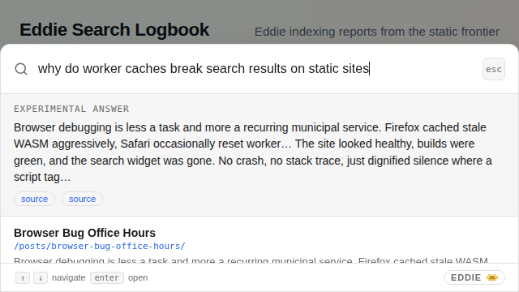
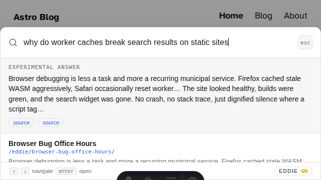
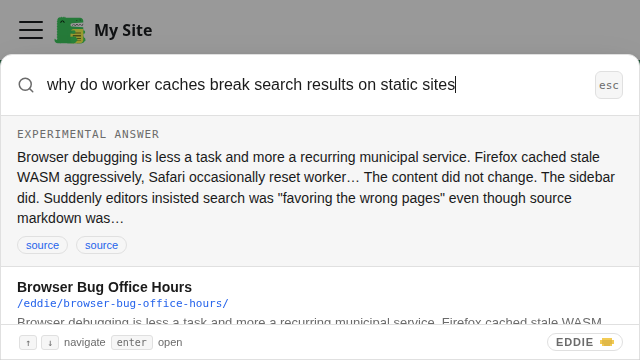
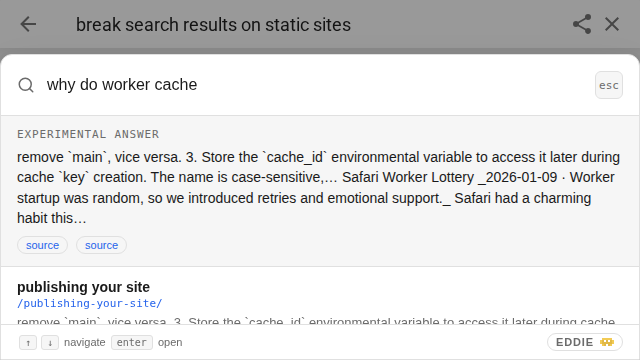
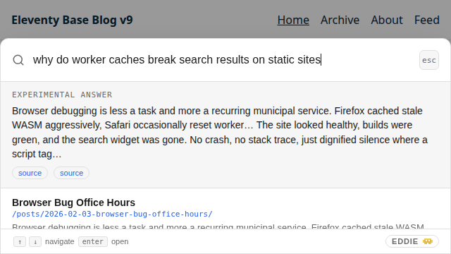
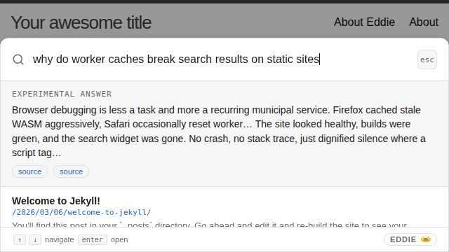
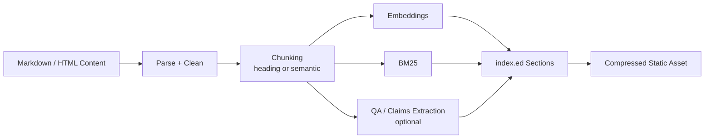

# Eddie

<p align="center">
  
</p>

**Your site's shipboard computer.**

Hybrid semantic + keyword search for static sites, with optional experimental Q&A — fully client-side, no server required. Runs entirely in your visitor's browser via WebAssembly.

> *"I'm just so happy to be doing this for you."*
> — Eddie, the Heart of Gold's shipboard computer

## Don't Panic

Eddie does three things:

1. **Build time:** A CLI reads your markdown/HTML content, chunks it, and generates embeddings using a sentence-transformer model. The result is a compact binary index shipped as a static asset. Simple, elegant, like a fjord.

2. **Runtime:** A WASM module in the browser downloads the same embedding model (from HuggingFace CDN, cached after first use), embeds the visitor's query, and performs hybrid semantic + keyword search against the pre-built index.

3. **Optional Q&A (experimental):** On browsers with WebGPU support, a small language model can synthesize a short answer from retrieved content. This is still experimental and falls back gracefully to search-only on browsers without WebGPU.

## Quick Start

### 1. Index your content

```bash
eddie index --content-dir content/ --output static/eddie/index.ed
```

### 2. Embed the widget

```html
<script src="/eddie-widget.js"></script>
```

### 3. Share and Enjoy

Visitors see a floating search button. First search triggers a one-time model download (~87MB cache footprint with the default model), then searches are instant. The answer to how long subsequent queries take is not 42 — it's closer to 42 milliseconds.

## CMS Demo Gallery

Search-in-progress screenshots with Eddie installed on each supported CMS integration:

| Hugo | Astro | Docusaurus |
| --- | --- | --- |
|  |  |  |

| MkDocs | Eleventy | Jekyll |
| --- | --- | --- |
|  |  |  |

Refresh these screenshots with:

```bash
bash scripts/capture-cms-gallery.sh
```

See [docs/guides/cms-gallery.md](docs/guides/cms-gallery.md) for full workflow and options.

### Precompressed Runtime Assets

The release pipeline now emits sidecar assets for runtime files:

- `eddie.wasm.br` / `eddie.wasm.gz`
- `eddie-wasm.js.br` / `eddie-wasm.js.gz`
- `eddie-worker.js.br` / `eddie-worker.js.gz`
- `eddie-widget.js.br` / `eddie-widget.js.gz`

Use normal URLs in HTML (`eddie-widget.js`, `eddie.wasm`, etc). Browsers should receive compressed bytes through standard HTTP content negotiation (`Accept-Encoding`).

Important: browser JS should not manually switch to `.br` filenames unless your host also sets correct response headers (`Content-Encoding: br` and the correct content type). Without those headers, `.br` files are just opaque bytes.

### Hugo Module Convenience Bootstrap

If you use `eddie-hugo`, you can scaffold local, gitignored settings + a one-command index wrapper:

```bash
bash scripts/eddie-init-site.sh /path/to/your-hugo-site
```

This creates:

1. `.eddie/local.env` (machine-local settings, gitignored)
2. `.eddie/claims.edits.toml` (optional manual claim edits, gitignored)
3. `scripts/eddie-index.sh` (convenience wrapper around `eddie index`)

Then you can index with:

```bash
bash scripts/eddie-index.sh
```

### Quality vs Speed Profiles (`.eddie/local.env`)

You can tune index quality by trading off build time:

```bash
# Fast profile
EDDIE_MODEL=sentence-transformers/all-MiniLM-L6-v2
EDDIE_CHUNK_SIZE=256
EDDIE_OVERLAP=32
EDDIE_QA_OLLAMA_MODEL=

# Quality-first local workstation profile
EDDIE_MODEL=sentence-transformers/all-MiniLM-L12-v2
EDDIE_CHUNK_SIZE=320
EDDIE_OVERLAP=48
EDDIE_QA_OLLAMA_MODEL=qwen2.5:32b
EDDIE_QA_OLLAMA_MAX_CHUNKS=96
EDDIE_QA_OLLAMA_MAX_PAIRS_PER_CHUNK=4
EDDIE_QA_OLLAMA_TEMPERATURE=0.1
```

Guideline:

1. Larger embedder + larger chunks typically improve recall/answer grounding.
2. Stronger Ollama model at index time improves QA/claim synthesis quality.
3. Build time and memory usage increase substantially.

## Guided Chunking Tuning (Site-Owned Acceptance Tests)

Keep acceptance tests in your site repo, not inside Eddie.

Example suite:

```bash
cp examples/acceptance-suite.json /path/to/your-site/eddie.acceptance.json
```

Run automated parameter sweep:

```bash
eddie tune \
  --content-dir content/ \
  --eval eddie.acceptance.json \
  --chunk-sizes 192,256,320 \
  --overlaps 16,32,48 \
  --mode hybrid \
  --report tune-report.json
```

Run guided interactive loop (collect query, expected phrases, user rating, then re-tune):

```bash
eddie tune \
  --content-dir content/ \
  --interactive \
  --save-eval eddie.acceptance.json
```

## Benchmark Suite (Tickets 8 + 14)

Eddie now includes a configurable benchmark harness for model/dataset matrix runs.

What it does:

1. Caches benchmark corpora locally (git sparse checkouts, excluded from git).
2. Runs clean index/search timing loops across any dataset/model combination.
3. Optionally uses OpenRouter:
   - larger model to generate stable query sets per dataset
   - smaller model to judge retrieval quality for sampled queries
4. Writes machine-friendly outputs (`CSV`, optional `Parquet`) plus markdown summary tables.
5. Computes deterministic retrieval metrics (`Hit@k`, `MRR`, `nDCG@k`) from human-maintained labels in `benchmarks/relevance_labels.toml`.

Default benchmark config: `benchmarks/benchmark.toml`
Deterministic relevance labels: `benchmarks/relevance_labels.toml`

Prepare datasets:

```bash
python3 scripts/benchmark_suite.py prepare
```

Generate stored query files (stable benchmark inputs):

```bash
export OPENROUTER_API_KEY=...
python3 scripts/benchmark_suite.py generate-queries
```

Run full matrix:

```bash
python3 scripts/benchmark_suite.py run --generate-queries
```

Filter example (single dataset/model quick run):

```bash
python3 scripts/benchmark_suite.py run \
  --dataset fastapi_docs \
  --model sentence-transformers/multi-qa-MiniLM-L6-cos-v1 \
  --runs-per-combo 1 \
  --query-limit 10
```

Render benchmark table:

```bash
python3 scripts/benchmark_suite.py render-report .bench/results/<run_id>
# or:
python3 scripts/render_benchmark_report.py .bench/results/<run_id>
```

## Single `index.ed` With Sections

Eddie now stores everything in one `index.ed` file:

1. `chunks` section: primary hybrid retrieval corpus (semantic + BM25).
2. `qa` section (optional): question/answer pairs with source attribution.
3. `claims` section (optional): atomic factual claims with evidence and source attribution.
4. `summary` lane (optional): lightweight doc summaries stored as retrieval chunks.

Note: this uses a new v4 index layout; rebuild indexes with the current Eddie binary.

Build with embedded QA + claims:

```bash
eddie index \
  --content-dir content/ \
  --output static/eddie/index.ed \
  --chunk-strategy semantic \
  --coarse-chunk-size 640 \
  --coarse-overlap 96 \
  --summary-lane \
  --qa \
  --claims
```

Build with local Ollama QA synthesis (good fit for a 4090 workstation):

```bash
eddie index \
  --content-dir content/ \
  --output static/eddie/index.ed \
  --chunk-strategy semantic \
  --coarse-chunk-size 640 \
  --summary-lane \
  --qa \
  --claims \
  --qa-ollama-model qwen2.5:7b-instruct \
  --qa-ollama-url http://127.0.0.1:11434/api/generate
```

Build with OpenRouter QA synthesis (optional, local-first still supported):

```bash
export OPENROUTER_API_KEY=...
eddie index \
  --content-dir content/ \
  --output static/eddie/index.ed \
  --chunk-strategy semantic \
  --coarse-chunk-size 640 \
  --summary-lane \
  --qa \
  --claims \
  --qa-openrouter-model openai/gpt-4.1-mini \
  --qa-openrouter-url https://openrouter.ai/api/v1/chat/completions \
  --qa-openrouter-api-key-env OPENROUTER_API_KEY
```

Search specific lanes:

```bash
eddie search --index static/eddie/index.ed --query "who has the subject worked for" --mode hybrid --scope all
eddie search --index static/eddie/index.ed --query "how many years has the subject been programming" --mode semantic --scope qa
eddie search --index static/eddie/index.ed --query "worked for nike" --mode semantic --scope claims
```

Recommended architecture:

1. Build time: use larger model (Ollama/OpenRouter) to synthesize high-signal QA and claims.
2. Runtime: use retrieval-first from `chunks` and optionally blend `qa`/`claims` lanes.
3. Answer generation: keep small runtime models grounded on cited evidence.
4. Runtime ranking now includes recency decay boost and multi-granularity fusion bonus.

## Human-Friendly Claim Edits

You can manually add or redact claims without graph tooling.

Create `claims.edits.toml`:

```toml
[[redact]]
predicate = "worked_for"
object = "Old Company"

[[add]]
subject = "Site Subject"
predicate = "worked_for"
object = "Nike"
evidence = "Manual correction"
source_url = "/about/"
confidence = 1.0
tags = ["manual"]
```

Apply during index build:

```bash
eddie index \
  --content-dir content/ \
  --output static/eddie/index.ed \
  --claims \
  --claims-edits claims.edits.toml
```

Export standalone corpora (optional debug/inspection):

```bash
eddie qa-corpus --index static/eddie/index.ed --output static/eddie/qa-corpus.json
eddie claims-corpus --index static/eddie/index.ed --output static/eddie/claims-corpus.json --claims-edits claims.edits.toml
```

## How It Compares

Eddie is built around fast hybrid retrieval (semantic + BM25) with snippets and ranking. Q&A is included as an optional experimental layer on top.

| Tool | Deployment | Search | Q&A | Server | Cost |
|------|-----------|--------|-----|--------|------|
| **Eddie** | Client (WASM) | Hybrid semantic + BM25 | Experimental (WebGPU) | No | Free |
| Pagefind | Client (WASM) | Keyword | No | No | Free |
| Algolia DocSearch | Cloud | Keyword + neural | No | Yes | Free for OSS |
| kapa.ai | Cloud | Semantic (RAG) | Yes | Yes | Enterprise |
| DocsBot | Cloud | Semantic (RAG) | Yes | Yes | $16–$416/mo |

## Configuration

Create `eddie.toml` in your site root (optional — defaults are carefully chosen, unlike Marvin's personality):

```toml
[embedding]
model = "sentence-transformers/multi-qa-MiniLM-L6-cos-v1"

[qa]
enabled = true
runtime = "webllm"
model = "HuggingFaceTB/SmolLM2-1.7B-Instruct"

[widget]
theme = "auto"
position = "bottom-right"
offsetX = 0
offsetY = 0
qaMode = "auto"
qaSubject = "site subject"
topK = 8
answerTopK = 5
```

`position` accepts `"top-left"`, `"top-right"`, `"bottom-left"`, or `"bottom-right"`.
Use `offsetX`/`offsetY` (pixels, can be negative) to nudge the launcher away from theme toggles or other fixed UI.
`qaMode` accepts `"off"`, `"auto"`, or `"always"` for experimental factual answer blending.
`qaSubject` lets site owners tune subject-specific factual prompts like `"does <subject> know X"`.

### Embedding Model Alternatives

The default model (`multi-qa-MiniLM-L6-cos-v1`) is Apache 2.0 and tuned for retrieval tasks. Models are fetched from HuggingFace CDN at runtime — Eddie doesn't redistribute model weights. If training data provenance matters to you:

| Model | License | Params |
|-------|---------|--------|
| `BAAI/bge-small-en-v1.5` | MIT | 33M |
| `Snowflake/snowflake-arctic-embed-s` | Apache 2.0 | 33M |
| `nomic-ai/modernbert-embed-base` | Apache 2.0 | 110M |

## How It Works

Eddie is a single Rust codebase that compiles to two targets — one might say it's *improbably* versatile:

1. **Native CLI** (`eddie`) — runs at build time to index your content
2. **WASM module** — runs in the browser for search and embedding

## Architecture

### Indexing Flow (Build Time)



### Widget Flow (Runtime)


The indexing pipeline:

```
Markdown/HTML → parse → chunk → embed (MiniLM, 384-dim) → BM25 index
                           ↘ optional QA/claims synthesis + embeddings
                           → serialize sections into one index.ed → Brotli pack (.ed)
```

The search pipeline (browser):

```
Query → download model (first use) → embed query → cosine similarity + BM25 → RRF fusion → ranked results
```

ML inference uses [Candle](https://github.com/huggingface/candle) (HuggingFace's Rust ML framework), which compiles to WASM without complaint. This is neural network inference running in a browser to search a blog — far more intelligent than the task demands, which Eddie would tell you is *exactly how he likes it*.

## Q&A Status (Experimental)

The core product value today is hybrid retrieval and result summaries/snippets. Q&A is a best-effort experimental mode and quality is highly dependent on your corpus and client hardware.

What this means in practice:

1. Smaller browser models can produce useful summaries, but factual precision can drift.
2. Broader or inconsistent corpora increase hallucination and contradiction risk.
3. On weaker devices, latency can be too high for a good UX.

Suggested model range to try (if supported by your chosen runtime/toolchain):

- `HuggingFaceTB/SmolLM2-1.7B-Instruct` (current default)
- `Qwen/Qwen2.5-1.5B-Instruct`
- `microsoft/Phi-3.5-mini-instruct`

Corpus strategies that generally improve answer quality:

- Keep content focused by domain/use-case rather than mixing unrelated material.
- Prefer explicit, factual writing with clear headings and stable terminology.
- Add canonical FAQ and glossary pages for key entities, policies, and definitions.
- Keep time-sensitive pages date-stamped and archive/redirect stale copies.
- Avoid indexing low-signal pages (thin marketing copy, duplicate boilerplate).

Likely future direction:

1. Use larger LLMs at index/build time (offline) to generate structured QA artifacts.
2. Produce question-answer pairs grounded in source chunks.
3. Build entity/fact cards with citations and claim-to-source maps.
4. Keep browser runtime lightweight for retrieval and synthesis over precomputed evidence.

This should improve factual reliability without requiring large on-device models for every query, while browser hardware catches up for stronger local Q&A.

## Papers and References

Foundational reading and implementation references behind the current approach:

- [BERT: Pre-training of Deep Bidirectional Transformers for Language Understanding](https://arxiv.org/abs/1810.04805)
- [Sentence-BERT: Sentence Embeddings using Siamese BERT-Networks](https://arxiv.org/abs/1908.10084)
- [MiniLM: Deep Self-Attention Distillation for Task-Agnostic Compression of Pre-Trained Transformers](https://arxiv.org/abs/2002.10957)
- [Reciprocal Rank Fusion Outperforms Condorcet and Individual Rank Learning Methods](https://plg.uwaterloo.ca/~gvcormac/cormacksigir09-rrf.pdf)
- [The Probabilistic Relevance Framework: BM25 and Beyond](https://www.nowpublishers.com/article/Details/INR-019)
- [WebAssembly](https://webassembly.org/)
- [WebGPU](https://www.w3.org/TR/webgpu/)
- [Hugging Face Candle](https://github.com/huggingface/candle)

## Q&A Papers (2025/2026)

Recent papers and resources we track for factual grounding with smaller runtime models:

- [SR-RAG: Learning to Retrieve and Reason in LLMs via Self-Reflection](https://arxiv.org/abs/2504.01018)
- [Adaptive Retrieval without Self-Knowledge?](https://arxiv.org/abs/2501.12835)
- [CER: Contrastive Evidence Re-ranking for Attributed Generation](https://arxiv.org/abs/2512.05012)
- [BRIGHT: A Realistic and Challenging Benchmark for Retrieval](https://arxiv.org/abs/2407.12883)
- [GraphRAG (paper)](https://arxiv.org/abs/2404.16130)
- [GraphRAG project updates](https://www.microsoft.com/en-us/research/project/graphrag/)

## GitHub Actions

```yaml
- name: Index content
  run: |
    curl -L https://github.com/jt55401/eddie/releases/latest/download/eddie-linux-amd64 -o eddie
    chmod +x eddie
    ./eddie index --content-dir content/ --output public/eddie/index.ed
```

## Project Layout

```
src/           Rust source (CLI + WASM shared core)
requirements/  Requirements-as-code
docs/plans/    Design documents
```

## Requirements

This project uses [requirements-as-code](https://github.com/jt55401/requirements-skill). See [requirements.md](requirements.md) for the full requirements tree.

## Contributing

See [CONTRIBUTING.md](CONTRIBUTING.md). Pull requests welcome — just don't ask Eddie to be less cheerful about it.

## License

GPL-3.0-only. See [LICENSE](LICENSE).

Copyright (c) 2026 Jason Grey. Project name and branding are not licensed under GPL — see [TRADEMARKS.md](TRADEMARKS.md).

## Support

If you find Eddie useful, use the GitHub Sponsor button on the repository.

For commercial integration or support, [Improbability Engineers](https://improbabilityengineers.com) offers consulting — they built the ship, after all.

---

*Eddie is the [Heart of Gold](https://en.wikipedia.org/wiki/Heart_of_Gold_(The_Hitchhiker%27s_Guide_to_the_Galaxy)) shipboard computer from The Hitchhiker's Guide to the Galaxy. The Heart of Gold is powered by the Infinite Improbability Drive. [Improbability Engineers](https://improbabilityengineers.com) builds the ship's computer.*

*So long, and thanks for all the search results.*
