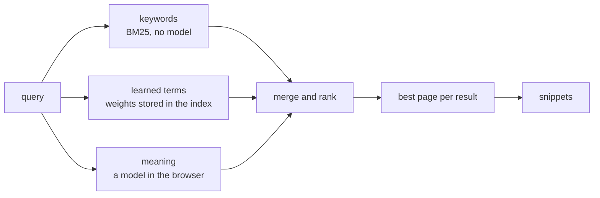

# Eddie

<p align="center">
  
</p>

**Your site's shipboard computer.**

Eddie adds search to a static site. It runs in your visitor's browser, so
there is no server to host, no API key to manage, and no monthly bill.

You run one command at build time. It reads your content and writes a
single index file next to your pages. You add one script tag. Visitors get
a search box that understands what they meant, not only the words they
typed.

> *"I'm just so happy to be doing this for you."*
> Eddie, the Heart of Gold's shipboard computer

## Is this for you?

Eddie suits a site that is built once and served as files: Hugo, Jekyll,
Astro, Docusaurus, Eleventy, MkDocs, or anything that produces HTML.

You need it if your site search is missing results people expect. Ordinary
keyword search only matches the words on the page. Someone searching for
"how do I get money back" will not find a page titled "Refunds". Eddie
matches meaning as well as words, so that search finds the page.

You do not need a database, a search service, or a backend of any kind.
The index is a file you deploy like an image.

## What it costs your visitors

Search runs on the visitor's device, so their browser does the work.

| What | When | Size |
|---|---|---|
| Loader script | Every page | 3 KB |
| Search engine | First time they open search | about 250 KB |
| Your index | First time they open search | depends on your site |
| Search model | Only if they agree to it | 45 MB and up |

Nothing downloads until someone opens the search box. The model is the only
large download, it is cached after the first time, and Eddie asks first and
names the size. A visitor who declines still gets keyword results.

## Quick start

### 1. Index your content

```bash
eddie index --content-dir content/ --cms hugo --output static/eddie/index.ed --preset balanced
```

### 2. Add the script

```html
<script src="/eddie/eddie-boot.js" data-index-url="/eddie/index.ed"></script>
```

On Hugo, the [`eddie-hugo` module](docs/guides/hugo.md) does both steps for
you from `[params.eddie]` in your `hugo.toml`.

### 3. Deploy

Visitors get a floating search button and a Ctrl/Cmd+K shortcut. The first
search takes a moment while the engine loads. After that, searches finish in
milliseconds.

The [user guide](docs/user-guide.md) covers installation, configuration and
deployment in full.

## How it works

Eddie searches three ways at once and merges the results.


```mermaid
flowchart LR
  Q[query] --> B["keywords<br/>BM25, no model"]
  Q --> S["learned terms<br/>weights stored in the index"]
  Q --> D["meaning<br/>a model in the browser"]
  B --> R[merge and rank]
  S --> R
  D --> R
  R --> G[best page per result]
  G --> N[snippets]
```

- **Keywords** match the words on the page. Fast, and always available.
- **Learned terms** match related words the page did not use. The weights
  are computed when you build the index, so the browser does no extra work.
- **Meaning** compares the sense of the query with the sense of each
  passage. This is the part that needs a model.

Merging three imperfect rankings beats trusting any one of them. If the
browser cannot run the model, the first two still work and results are
still useful.

There is one more thing Eddie can do. On a browser with a modern graphics
API (WebGPU), a small language model can read the top results and write a
short answer with citations. It is optional, it asks before downloading,
and everywhere else Eddie is a search box.

## Documentation

| Page | What is in it |
|---|---|
| [User guide](docs/user-guide.md) | Install, index, embed, configure, deploy |
| [Reference](docs/reference.md) | Every CLI command and flag, the models, the index format |
| [Tuning](docs/tuning.md) | Measure result quality and improve it |
| [Benchmarks](docs/benchmarks.md) | How Eddie is measured, and how it compares |
| [Widget internals](widget/README.md) | The browser runtime, for people changing it |

Per-CMS guides: [Hugo](docs/guides/hugo.md),
[GitHub Actions](docs/guides/github-actions.md),
[screenshot gallery](docs/guides/cms-gallery.md).

## How it compares

| Tool | Runs on | Search | Answers | Server | Cost |
|---|---|---|---|---|---|
| **Eddie** | Visitor's browser | Keywords, learned terms and meaning | Yes, cited | No | Free |
| Pagefind | Visitor's browser | Keywords | No | No | Free |
| Algolia DocSearch | Cloud | Keywords and meaning | No | Yes | Free for open source |
| kapa.ai | Cloud | Meaning | Yes | Yes | Enterprise |
| DocsBot | Cloud | Meaning | Yes | Yes | $16–$416/month |

## Project layout

```
src/           Rust source, shared by the CLI and the browser build
widget/        The browser widget
integrations/  Installers for each CMS (npm, gem, PyPI)
hugo-module/   Hugo module
requirements/  Requirements as code
docs/          Documentation
```

Eddie is one Rust codebase built two ways: a command-line tool that indexes
your content, and a WebAssembly module that searches it in the browser.

## Requirements

This project uses [requirements as code](https://github.com/jt55401/requirements-skill).
See [requirements.md](requirements.md) for the full tree.

## Contributing

See [CONTRIBUTING.md](CONTRIBUTING.md). Pull requests welcome. Just do not
ask Eddie to be less cheerful about it.

## License

GPL-3.0-only. See [LICENSE](LICENSE).

Copyright (c) 2026 Jason Grey. The project name and branding are not
licensed under the GPL; see [TRADEMARKS.md](TRADEMARKS.md).

## Support

If you find Eddie useful, use the GitHub Sponsor button on the repository.

For commercial integration or support,
[Improbability Engineers](https://improbabilityengineers.com) offers
consulting. They built the ship, after all.

---

*Eddie is the [Heart of Gold](https://en.wikipedia.org/wiki/Heart_of_Gold_(The_Hitchhiker%27s_Guide_to_the_Galaxy)) shipboard computer from The Hitchhiker's Guide to the Galaxy. The Heart of Gold is powered by the Infinite Improbability Drive. [Improbability Engineers](https://improbabilityengineers.com) builds the ship's computer.*

*So long, and thanks for all the search results.*
