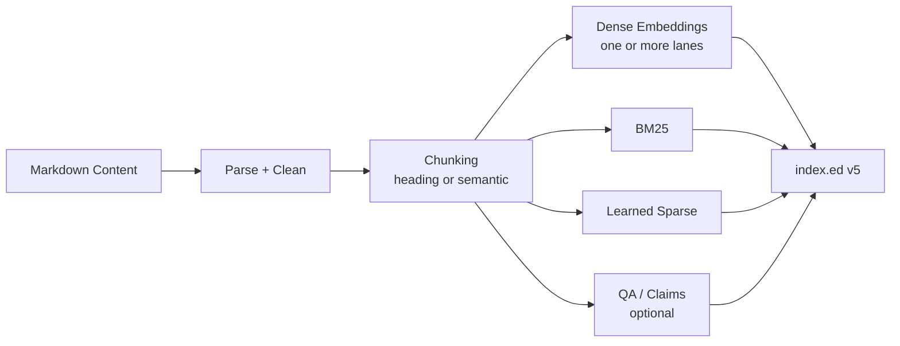
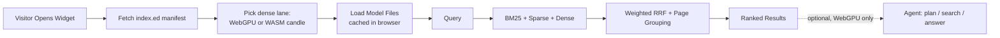
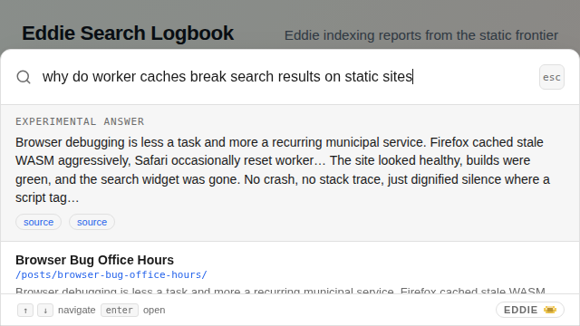
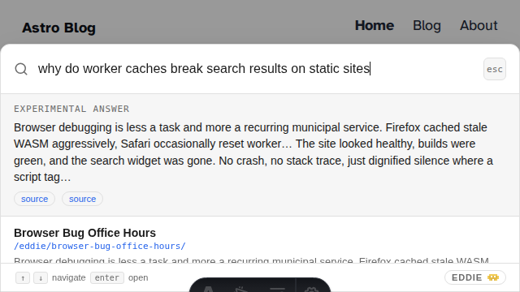
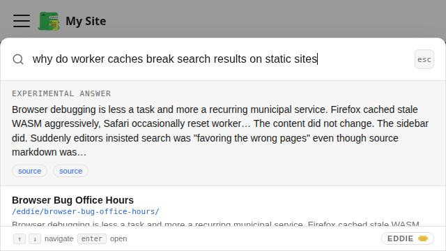
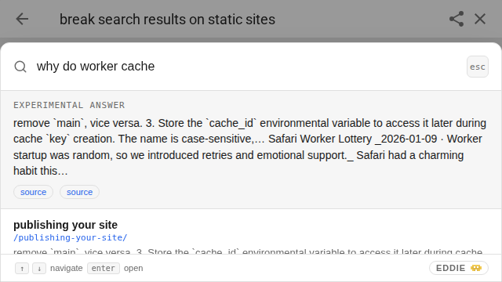
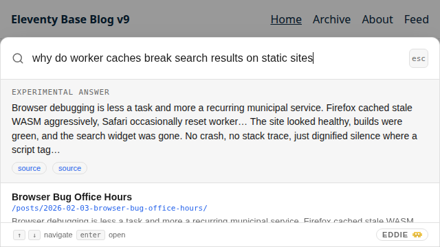
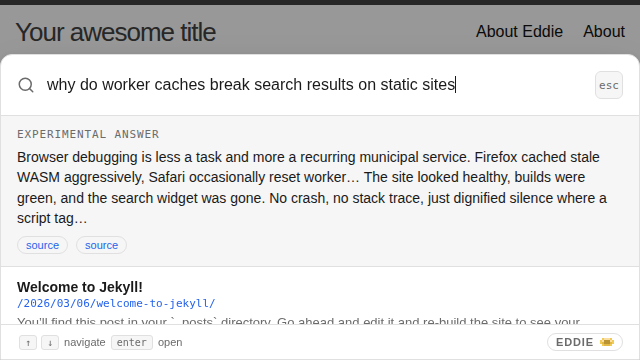

# Eddie

<p align="center">
  
</p>

**Your site's shipboard computer.**

Hybrid search for static sites, combining BM25, a learned sparse arm, and
dense embeddings, fused and ranked client-side. An optional in-browser
agent answers questions with citations. No server, no API key. Runs
entirely in your visitor's browser via WebAssembly and, where available,
WebGPU.

> *"I'm just so happy to be doing this for you."*
> Eddie, the Heart of Gold's shipboard computer

## Don't Panic

Eddie does three things:

1. **Build time:** A CLI reads your markdown content, chunks it by heading (or by semantic boundary), and builds three retrieval arms: a BM25 keyword index, a learned sparse index, and one or more dense embedding lanes. The result is a single Brotli-compressed index file (`.ed`, format v5).
2. **Runtime:** A WASM module downloads whichever models the retrieval arms need (cached after first use), embeds the visitor's query, and fuses BM25 + sparse + dense scores with reciprocal rank fusion.
3. **Optional agent:** On browsers with a WebGPU adapter, a small LLM (WebLLM, Qwen3.5) runs a bounded tool loop over the same retriever and streams a cited answer. Falls back to search-only everywhere else.

## Quick Start

### 1. Index your content

```bash
eddie index --content-dir content/ --cms hugo --output static/eddie/index.ed --preset balanced
```

### 2. Embed the widget

```html
<script src="/eddie-widget.js"></script>
```

Using Hugo? The [`eddie-hugo` module](docs/guides/hugo.md) wires this up
for you, including every `data-*` attribute, from `[params.eddie]` in your
`hugo.toml`.

### 3. Share and Enjoy

Visitors see a floating search button. The first search triggers a one-time
model download, then searches run in milliseconds. Which model downloads,
and how large it is, depends on the preset you indexed with and what the
visitor's browser can run. See the model table below.

## Retrieval architecture

```
query ─┬─ BM25: in-index tokenizer, no model ────────────────────┐
       ├─ sparse: WordPiece(query) × IDF, no model ───────────────┤ weighted RRF → page grouping → snippets
       └─ dense: WASM candle (bert) or transformers.js (WebGPU) ──┘
```

- **BM25** (`k1=1.2`, `b=0.75`) always runs; it costs nothing extra since the
  tokenizer and postings are in every index.
- **Sparse** is a learned, inference-free arm: the index stores per-term IDF
  weights computed at build time with `opensearch-project/opensearch-neural-sparse-encoding-doc-v3-distill`,
  and the browser just tokenizes the query and looks weights up; it costs no
  extra model download and no extra forward pass.
- **Dense** runs one of two ways depending on what the visitor's browser
  supports: `wasm-candle` (bert-family models, CPU, always available) or
  `webgpu-onnx` (larger models via transformers.js, only with a WebGPU
  adapter). If neither is runnable, dense is skipped and BM25 + sparse still
  run.

Fusion is reciprocal rank fusion (`k=60`) with per-arm weights (dense 1.0,
sparse 1.0, BM25 0.8; BM25 goes to 1.0 when an index has no sparse arm),
followed by page-level grouping (best chunk per URL, with a bounded
agreement bonus when a second chunk on the same page also scored well) and
a recency tie-breaker for dated pages.

## CLI reference

```
eddie index --content-dir <path> --cms <hugo|astro|docusaurus|eleventy|jekyll|mkdocs|html> --output <index.ed>
            [--dense-model <id>]...  [--sparse | --sparse-model <id>]
            [--device auto|cpu|cuda] [--batch-size 32]
            [--chunk-size 256] [--overlap 32] [--chunk-strategy heading|semantic]
            [--qa ...] [--claims ...] [--preset fast|balanced|quality|gpu]

eddie search --index <index.ed> --query <text>
             [--mode hybrid|dense|sparse|keyword] [--lane <id>] [--top-k 8] [--json]

eddie stats --index <index.ed>
eddie eval  --index <index.ed> --labels <labels.toml>
eddie tune  --content-dir <path> --eval <labels.toml> [...]
```

`eddie search` reads the dense lane(s), the sparse arm, and the tokenizer
from the index itself; there is no `--model` flag, so query-time and
index-time embeddings can't drift apart. `eddie stats` prints the manifest,
lane ids, and sparse term count; `eddie eval`/`eddie tune` compute Hit@k,
MRR, and nDCG against a labelled query set.

`--cms html` indexes a site's built HTML instead of its markdown source, for
sites whose copy lives in templates rather than content files: point
`--content-dir` at the render output (a Hugo `public/` directory, or
equivalent). It reads `<meta property="og:title">`, the first `<h1>`, or
`<title>` for the page title; `<meta name="description">` for the
description; `<meta property="article:published_time">` or `<time
datetime>` for the date; and the body from `<main>` or `<article>`, falling
back to `<body>` with `<nav>`, `<header>`, `<footer>`, `<aside>`, and the
Eddie widget itself stripped out. It skips `404.html`, `tags/`,
`categories/`, and `page/N/` (Hugo's taxonomy and pagination output),
pages with `<meta name="robots" content="noindex">` (unless the page is
opted back in at the library level via `HtmlOptions::include_noindex`, not
yet a CLI flag), and pages whose extracted body comes out under 20 words.

### Presets

`--preset` bundles a dense model set (and device) in one flag:

| Preset | Dense lane(s) | Sparse | Device |
|---|---|---|---|
| `fast` | MiniLM-L6 | no | CPU |
| `balanced` | bge-small-en-v1.5 | yes | CPU |
| `quality` | bge-small-en-v1.5 + Qwen3-Embedding-0.6B | yes | CPU |
| `gpu` | same as `quality` | yes | CUDA |

CUDA acceleration at index time is not part of the published release binary;
build it yourself with `cargo build --release --features cuda` against a
local CUDA toolkit.

## Models

Dense embedding models run in one of two lanes. The `wasm-candle` lane
(bert-family architectures only) runs on CPU in the WASM module and works
in every browser. The `webgpu-onnx` lane runs larger models via
transformers.js and only activates when the visitor's browser gives a
WebGPU adapter; otherwise that lane is skipped and BM25 + sparse still
serve results.

| Model | Lane | License | Dimensions | Notes |
|---|---|---|---|---|
| `sentence-transformers/multi-qa-MiniLM-L6-cos-v1` | `wasm-candle` | Apache-2.0 | 384 | Default, retrieval-tuned |
| `BAAI/bge-small-en-v1.5` | `wasm-candle` | MIT | 384 | `balanced`/`quality` preset default |
| `Snowflake/snowflake-arctic-embed-s` | `wasm-candle` | Apache-2.0 | 384 | Clean training-data provenance |
| `Qwen/Qwen3-Embedding-0.6B` | `webgpu-onnx` | Apache-2.0 | 1024 | `quality`/`gpu` preset; 184 ms/query warm (q4, WebGPU) |
| `microsoft/harrier-oss-v1-0.6b` | `webgpu-onnx` | MIT | 1024 | Last-token pooling, 32k context |
| `BAAI/bge-m3` | `webgpu-onnx` | MIT | 1024 | 779 ms/query warm (q8, WebGPU) |

Models are fetched from HuggingFace at runtime; Eddie doesn't redistribute
weights. WebGPU dtype selection depends on the adapter: `q4f16_1`-style
builds need `shader-f16`; without it, Eddie falls back to an `f32`
variant, which is slower but works everywhere WebGPU itself works.

## Optional in-browser agent

On top of retrieval, a small LLM can run a bounded tool loop (plan → search
→ optionally read a page → answer, four tool calls max) over the same
retriever and stream a cited answer. It needs a WebGPU adapter with at
least 1 GiB of buffer capacity, and it asks for consent before downloading
anything. The consent prompt states the download size up front, and the
choice is remembered in `localStorage`.

| `data-agent-model` | Model | Weights |
|---|---|---|
| `auto` (default) | Qwen3.5-0.8B | ≈ 0.4 GB |
| `quality` | Qwen3.5-2B | ≈ 1.2 GB |
| any other value | passed through as a literal WebLLM model id | varies |

Runtime is [WebLLM](https://github.com/mlc-ai/web-llm). On Linux
Chromium/Vulkan without `shader-f16`, the `q4f16_1` build variant fails WGSL
validation; Eddie uses `q4f32_1` there instead, which measured 62 tok/s
(0.8B) and 52 tok/s (2B) on an RTX 4090. Answers cite retrieved evidence as
`[n]`; when there's no supporting evidence, the agent says the site doesn't
cover the question instead of guessing.

Q&A retrieval (build-time question/answer synthesis via `--qa`) still runs
at index time and feeds the agent's evidence list. See the CLI reference
above.

## Index format

Indexes use format v5 (`SAED` container, `SAGI` payload sections for
metadata, texts, BM25, sparse, and one or more dense lanes). A v0.4 CLI
rejects v1-v4 index files with a "rebuild with eddie 0.4" message. There's
no in-place migration, so rebuild with `eddie index` after upgrading.

## Configuration

There's no config file (`eddie.toml`). The indexer reads CLI flags, and the
widget reads `data-*` attributes on its `<script>` tag (or, on Hugo,
`[params.eddie]` in `hugo.toml`, which the module partial turns into those
same attributes for you):

```html
<script src="/eddie-widget.js"
        data-index-url="/eddie/index.ed"
        data-position="bottom-right"
        data-theme="auto"
        data-qa-mode="auto"
        data-top-k="8"
        data-answer-top-k="5"
        data-agent-mode="auto"
        data-agent-model="auto"
        data-dense-runtime="auto"
        data-consent-text=""
></script>
```

- `data-position` accepts `top-left`, `top-right`, `bottom-left`, or `bottom-right`.
- `data-theme` accepts `light`, `dark`, or `auto` (follows `prefers-color-scheme`).
- `data-qa-mode` accepts `off`, `auto`, or `always` for the retrieval-only answer blend.
- `data-agent-mode` accepts `off` or `auto` for the in-browser LLM agent.
- `data-agent-model` accepts `auto`, `quality`, or an explicit WebLLM model id (see the agent table above).
- `data-dense-runtime` accepts `auto`, `wasm`, or `webgpu` to force one dense lane instead of auto-selecting.
- `data-consent-text` overrides the widget's built-in model-download consent copy.

## Tuning chunk size and ranking

Keep acceptance tests in your site repo, not inside Eddie. Start from the
example suite:

```bash
cp examples/acceptance-suite.json /path/to/your-site/eddie.acceptance.json
```

Run an automated parameter sweep over chunk size and overlap:

```bash
eddie tune \
  --content-dir content/ \
  --eval eddie.acceptance.json \
  --chunk-sizes 192,256,320 \
  --overlaps 16,32,48 \
  --mode hybrid \
  --report tune-report.json
```

Or run the guided interactive loop, which asks for a query, the phrases you
expect to see, and a rating, then re-tunes from what it collects:

```bash
eddie tune --content-dir content/ --interactive --save-eval eddie.acceptance.json
```

## Human-friendly claim edits

Build-time claim extraction (`--claims`) can mislabel or miss a fact. Fix it
without graph tooling by writing a `claims.edits.toml` (see
`examples/claims.edits.toml` for a template):

```toml
[[redact]]
predicate = "worked_for"
object = "Old Company"

[[add]]
subject = "Site Subject"
predicate = "worked_for"
object = "Nike"
evidence = "Manual correction"
source_url = "/about/"
confidence = 1.0
tags = ["manual"]
```

Apply it during indexing:

```bash
eddie index --content-dir content/ --output static/eddie/index.ed --claims --claims-edits claims.edits.toml
```

## Benchmark suite

`scripts/benchmark_suite.py` runs model/dataset matrix timing and quality
comparisons:

1. Caches benchmark corpora locally (git sparse checkouts, excluded from git).
2. Runs clean index/search timing loops across any dataset/model combination.
3. Optionally uses OpenRouter to generate a stable query set per dataset and to judge retrieval quality for sampled queries.
4. Writes CSV (and optional Parquet) plus a markdown summary table.
5. Computes Hit@k, MRR, and nDCG@k against human-maintained labels in `benchmarks/relevance_labels.toml`.

```bash
python3 scripts/benchmark_suite.py prepare
python3 scripts/benchmark_suite.py run --generate-queries
python3 scripts/benchmark_suite.py render-report .bench/results/<run_id>
```

See `benchmarks/README.md` for the full option list.

## How It Compares

| Tool | Deployment | Search | Q&A | Server | Cost |
|------|-----------|--------|-----|--------|------|
| **Eddie** | Client (WASM/WebGPU) | BM25 + learned sparse + dense, RRF-fused | Agent, cited (WebGPU) | No | Free |
| Pagefind | Client (WASM) | Keyword | No | No | Free |
| Algolia DocSearch | Cloud | Keyword + neural | No | Yes | Free for OSS |
| kapa.ai | Cloud | Semantic (RAG) | Yes | Yes | Enterprise |
| DocsBot | Cloud | Semantic (RAG) | Yes | Yes | $16-$416/mo |

## How It Works

Eddie is a single Rust codebase that compiles to two targets:

1. **Native CLI** (`eddie`), which runs at build time to index your content
2. **WASM module**, which runs in the browser for retrieval, ranking, and (via WebGPU) the agent

### Indexing Flow (Build Time)


```mermaid
flowchart LR
  A[Markdown Content] --> B[Parse + Clean]
  B --> C[Chunking<br/>heading or semantic]
  C --> D[Dense Embeddings<br/>one or more lanes]
  C --> E[BM25]
  C --> F[Learned Sparse]
  C --> G[QA / Claims<br/>optional]
  D --> H[index.ed v5]
  E --> H
  F --> H
  G --> H
```

### Widget Flow (Runtime)


```mermaid
flowchart LR
  A[Visitor Opens Widget] --> B[Fetch index.ed manifest]
  B --> C[Pick dense lane:<br/>WebGPU or WASM candle]
  C --> D[Load Model Files<br/>cached in browser]
  D --> E[Query]
  E --> F[BM25 + Sparse + Dense]
  F --> G[Weighted RRF + Page Grouping]
  G --> H[Ranked Results]
  H -.optional, WebGPU only.-> I[Agent: plan / search / answer]
```

ML inference uses [Candle](https://github.com/huggingface/candle)
(HuggingFace's Rust ML framework) for the WASM lane, and
[transformers.js](https://github.com/huggingface/transformers.js) +
[WebLLM](https://github.com/mlc-ai/web-llm) for the WebGPU lanes.

## Papers and References

- [BERT: Pre-training of Deep Bidirectional Transformers for Language Understanding](https://arxiv.org/abs/1810.04805)
- [Sentence-BERT: Sentence Embeddings using Siamese BERT-Networks](https://arxiv.org/abs/1908.10084)
- [MiniLM: Deep Self-Attention Distillation for Task-Agnostic Compression of Pre-Trained Transformers](https://arxiv.org/abs/2002.10957)
- [Reciprocal Rank Fusion Outperforms Condorcet and Individual Rank Learning Methods](https://plg.uwaterloo.ca/~gvcormac/cormacksigir09-rrf.pdf)
- [The Probabilistic Relevance Framework: BM25 and Beyond](https://www.nowpublishers.com/article/Details/INR-019)
- [BGE M3-Embedding: Multi-Lingual, Multi-Functionality, Multi-Granularity Text Embeddings](https://arxiv.org/abs/2402.03216)
- [WebAssembly](https://webassembly.org/)
- [WebGPU](https://www.w3.org/TR/webgpu/)
- [Hugging Face Candle](https://github.com/huggingface/candle)
- [WebLLM](https://github.com/mlc-ai/web-llm)

## CMS Demo Gallery

Search-in-progress screenshots with Eddie installed on each supported CMS integration:

| Hugo | Astro | Docusaurus |
| --- | --- | --- |
|  |  |  |

| MkDocs | Eleventy | Jekyll |
| --- | --- | --- |
|  |  |  |

Refresh these screenshots with:

```bash
bash scripts/capture-cms-gallery.sh
```

See [docs/guides/cms-gallery.md](docs/guides/cms-gallery.md) for the full workflow and options.

### Precompressed runtime assets

The release pipeline emits sidecar assets for every runtime file:

- `eddie.wasm.br` / `eddie.wasm.gz`
- `eddie-wasm.js.br` / `eddie-wasm.js.gz`
- `eddie-worker.js.br` / `eddie-worker.js.gz`
- `eddie-agent-worker.js.br` / `eddie-agent-worker.js.gz` (loaded only when a visitor clicks Ask)
- `eddie-widget.js.br` / `eddie-widget.js.gz`

Use the plain filenames in HTML (`eddie-widget.js`, `eddie.wasm`, etc). Your
host should serve compressed bytes via standard `Accept-Encoding`
negotiation. Browser JS should not switch to the `.br`/`.gz` filenames
directly unless your host also sets `Content-Encoding` and the correct
content type on them. Without those headers, they're just opaque bytes.

## GitHub Actions

Use `.github/workflows/example-hugo.yml` in this repo as a template. It
pins the Hugo version and the `@jt55401/eddie-cli` version explicitly
(never `latest`), and the CLI launcher verifies the downloaded binary
against the release's `SHA256SUMS` before running it:

```yaml
- name: Generate Eddie index into Hugo static/
  run: npx -y @jt55401/eddie-cli@0.4.0 index --cms hugo --content-dir content/ --output public/eddie/index.ed
```

See [docs/guides/github-actions.md](docs/guides/github-actions.md) for the
full release pipeline, including the platform binaries `eddie-linux-x86_64`,
`eddie-linux-aarch64`, `eddie-macos-x86_64`, `eddie-macos-aarch64`, and
`eddie-windows-x86_64.exe` published on every tag.

## Project Layout

```
src/           Rust source (CLI + WASM shared core)
widget/        Browser widget JS (worker, UI, agent)
integrations/  Per-CMS installer packages (npm, gem, PyPI)
hugo-module/   Hugo Module (partial, init script, defaults)
requirements/  Requirements-as-code
docs/plans/    Design documents
```

## Requirements

This project uses [requirements-as-code](https://github.com/jt55401/requirements-skill). See [requirements.md](requirements.md) for the full requirements tree.

## Contributing

See [CONTRIBUTING.md](CONTRIBUTING.md). Pull requests welcome. Just don't ask Eddie to be less cheerful about it.

## License

GPL-3.0-only. See [LICENSE](LICENSE).

Copyright (c) 2026 Jason Grey. Project name and branding are not licensed under GPL; see [TRADEMARKS.md](TRADEMARKS.md).

## Support

If you find Eddie useful, use the GitHub Sponsor button on the repository.

For commercial integration or support, [Improbability Engineers](https://improbabilityengineers.com) offers consulting. They built the ship, after all.

---

*Eddie is the [Heart of Gold](https://en.wikipedia.org/wiki/Heart_of_Gold_(The_Hitchhiker%27s_Guide_to_the_Galaxy)) shipboard computer from The Hitchhiker's Guide to the Galaxy. The Heart of Gold is powered by the Infinite Improbability Drive. [Improbability Engineers](https://improbabilityengineers.com) builds the ship's computer.*

*So long, and thanks for all the search results.*
