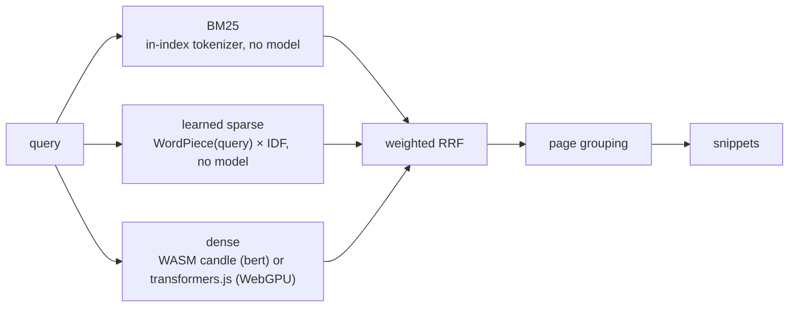

# Eddie v0.4 — Retrieval and Agent Upgrade

**Date:** 2026-08-28
**Status:** In progress
**Inputs:** adversarial review of v0.2.4 (`docs/reviews/2026-08-28-adversarial-review.md`), browser and toolchain probes (see "Verified facts").

## Goals

1. Fix the defects the review found (parsing, chunking, embedding, ranking, index safety, widget, CI, docs).
2. Three-arm hybrid retrieval: BM25 + learned sparse + dense, weighted RRF, page grouping.
3. Dense embedders beyond BERT: XLM-RoBERTa (bge-m3) and Qwen3 (Qwen3-Embedding-0.6B, Harrier-0.6B). CUDA at index time; WebGPU (transformers.js) at query time when the visitor has it.
4. A real in-browser agent: WebLLM + Qwen3.5 small models, a bounded tool loop over the WASM retriever, streamed cited answers. The heuristic sentence synthesizer in `wasm.rs` goes away.
5. Speed and size: tokenizer padding off, real batching, int8 dense vectors, binary postings, one query embedding per search, native `opt-level=3`.
6. Release v0.4.0, republish the Hugo module, upgrade www.jason-grey.com.

## Verified facts (2026-08-28)

- candle-transformers 0.11.0 ships `bert` (with `BertForMaskedLM`), `distilbert` (with `DistilBertForMaskedLM`), `xlm_roberta`, `qwen3`, `gemma3`, `modernbert`; features `cuda`, `cudnn`, `metal`, `mkl`. Local CUDA 13.0 toolkit exists under `~/.local/cuda-pip` (see memory `reference-local-cuda-toolkit`).
- `microsoft/harrier-oss-v1-0.6b` config: `Qwen3Model`, 28 layers, hidden 1024, vocab 151936, `max_position_embeddings` 32768, tied embeddings. Last-token pooling. Query format `Instruct: {task}\nQuery: {text}`; documents get no prefix. MIT.
- `Qwen/Qwen3-Embedding-0.6B`: same architecture family, same query format, Apache-2.0, MRL-capable.
- `BAAI/bge-m3`: XLM-RoBERTa-large, only `pytorch_model.bin` (2.27 GB), `sparse_linear.pt`, `colbert_linear.pt`. CLS pooling, 1024-d. Browser port `Xenova/bge-m3` (q8 verified on WebGPU, 779 ms/query warm).
- `opensearch-project/opensearch-neural-sparse-encoding-doc-v3-distill`: DistilBERT MLM (`model.safetensors` 268 MB), ships `idf.json` (889 KB), `tokenizer.json`, `query_token_weights.txt`. Query side is tokenizer + IDF lookup only.
- WebLLM `@mlc-ai/web-llm@0.2.84` (esm.run): `Qwen3.5-0.8B`, `Qwen3.5-2B`, `Qwen3.5-4B` in `q4f16_1` and `q4f32_1`. On Linux Chromium/Vulkan (no `shader-f16`) every `q4f16_1` build fails WGSL validation; `q4f32_1` works (0.8B: 62 tok/s, 2B: 52 tok/s on an RTX 4090). `extra_body.enable_thinking` is ignored; `/no_think` works and `<think></think>` must be stripped. `gemma3-1b-it` needs `overrides.sliding_window_size = -1`. `response_format: {type: "json_object", schema}` works.
- transformers.js `@huggingface/transformers@4.2.0` (jsDelivr): `onnx-community/Qwen3-Embedding-0.6B-ONNX` `q4` on WebGPU = 184 ms/query warm, 1024-d. `onnx-community/harrier-oss-v1-0.6b-ONNX` has `model_q4.onnx` + 399 MB external data. `dtype: fp16` is refused on adapters without f16.
- Default model tokenizer.json (`multi-qa-MiniLM-L6-cos-v1`) carries `padding: Fixed(250)` and `truncation: 250`; all-MiniLM variants carry 128. The current code inherits both.

## Retrieval architecture



### Arms

- **BM25**: unchanged scoring (k1 1.2, b 0.75). Postings stored binary with a sorted term dictionary so builds are deterministic. Tokenizer: lowercase, Unicode alphanumeric runs; CJK runs split into bigrams.
- **Sparse (learned, inference-free)**: doc side at index time with the OpenSearch doc-v3-distill encoder: `w(t) = max_over_positions(log(1 + relu(logit_t)))`, keep top terms until weight < 0.1 × max (the model card's pruning). Query side: WordPiece tokens of the query, weight = IDF from `idf.json`, duplicates collapsed to max. Score = Σ q_w · d_w. The index stores the IDF only for terms that occur in the postings, keyed by token id, plus the tokenizer repo id and vocab hash so the runtime can fetch/validate the tokenizer.
- **Dense**: one or more lanes per index. Each lane is one model. The runtime picks the best lane it can run:
  - `wasm-candle` lanes (bert family only) run in the existing WASM path on CPU.
  - `webgpu-onnx` lanes run in JS via transformers.js when `navigator.gpu` gives an adapter; the JS side embeds the query and hands the vector to WASM for scoring.
  - If no runnable lane exists, dense is skipped and the widget says so once (BM25 + sparse still run).

### Fusion

- RRF, `k = 60`, per-arm weights (defaults since 0.4.1: dense 1.0, sparse 1.2, bm25 1.0, the most robust setting across sweeps on three labelled sets; `--weights` bakes per-site values into the manifest; bm25 1.0 when there is no sparse arm). `fetch_k = max(3 × top_k, 30)` per arm, fused at chunk level.
- Ties broken deterministically (chunk index).
- Page grouping: best chunk per URL; pages get a bounded agreement bonus: `+0.10 × score(second-best distinct-granularity chunk)`.
- Recency: tie-breaker only (applied as `1e-6 × decay`), never a multiplier. Undated pages are neutral.
- Snippets: the sentence window (≤ 180 chars) with the most query-term hits, taken from the chunk text with the overlap prefix removed; falls back to the chunk start.

## Index format v5

Container (`SAED` v2):

```
"SAED" | u32 version=2 | u32 manifest_len | manifest JSON (uncompressed)
      | u32 payload_len | u32 payload_crc32 | u32 decompressed_len | brotli(payload)
```

The manifest is readable without decompressing anything, so the worker can decide which models to fetch first. Every length is checked against the remaining bytes before allocation; `decompressed_len` bounds the brotli output; CRC32 covers the decompressed payload.

Payload (`SAGI` v5) is a sequence of sections: `u32 name_len | name | u32 body_len | body`, unknown names skipped.

| section | body |
|---|---|
| `meta` | JSON `Vec<ChunkMeta>` (`title, url, section, date, granularity, chunk_index, page_id`) |
| `texts` | `u32 n` then `n × (u32 len, UTF-8)`; each chunk text is stored **without** its overlap prefix, with `u16 overlap_words` so display and BM25 use the clean text |
| `bm25` | binary: `u32 num_docs, f32 avg_len, u32 doc_lengths[n]`, `u32 terms`, then per term `u16 len, bytes, u32 postings, (varint doc_delta, u32 tf)` |
| `sparse` | `u32 terms`, per term `u32 token_id, f32 idf, u32 postings, (varint doc_delta, u16 weight_fixed)` where weight = `u16 / 1000` |
| `dense/<scope>/<lane_id>` | `u8 quant (0=f32, 1=int8), u32 dim, u32 rows`, then rows × dim (`f32` or `i8`) and, for int8, `rows × f32 scale`. `scope` ∈ `chunks`, `qa`, `claims` |
| `qa` | JSON `Vec<QaEntry>` |
| `claims` | JSON `Vec<ClaimEntry>` |

Manifest JSON:

```json
{
  "format": 5,
  "eddie": "0.4.0",
  "chunks": 812,
  "pages": 153,
  "dense": [
    {"id": "minilm", "model": "sentence-transformers/multi-qa-MiniLM-L6-cos-v1", "family": "bert",
     "dim": 384, "pooling": "cls", "normalize": true, "query_prefix": "", "doc_prefix": "",
     "max_seq_len": 512, "quant": "int8", "revision": "<hf commit>",
     "runtime": {"kind": "wasm-candle", "files": ["config.json", "tokenizer.json", "model.safetensors"]}},
    {"id": "qwen3e", "model": "Qwen/Qwen3-Embedding-0.6B", "family": "qwen3",
     "dim": 1024, "pooling": "last", "normalize": true,
     "query_prefix": "Instruct: Given a web search query, retrieve relevant passages that answer the query\nQuery: ",
     "doc_prefix": "", "max_seq_len": 512, "quant": "int8",
     "runtime": {"kind": "webgpu-onnx", "repo": "onnx-community/Qwen3-Embedding-0.6B-ONNX", "dtype": "q4", "dtype_f16": "q4f16", "pooling": "last_token"}}
  ],
  "sparse": {"model": "opensearch-project/opensearch-neural-sparse-encoding-doc-v3-distill",
             "tokenizer": "opensearch-project/opensearch-neural-sparse-encoding-doc-v3-distill",
             "revision": "<hf commit>", "vocab_hash": "<sha256 of tokenizer.json>", "terms": 21044},
  "bm25": {"k1": 1.2, "b": 0.75},
  "sections": ["qa", "claims"],
  "built_at": "2026-08-28T21:00:00Z"
}
```

## Rust interfaces

### `src/embed.rs`

```rust
pub enum Pooling { Mean, Cls, LastToken }
pub enum Family { Bert, XlmRoberta, Qwen3 }
pub enum TextKind { Query, Document }

pub struct DenseSpec {            // serialised into the manifest "dense" entries
    pub id: String, pub model: String, pub family: Family, pub dim: usize, pub pooling: Pooling,
    pub normalize: bool, pub query_prefix: String, pub doc_prefix: String, pub max_seq_len: usize,
    pub revision: Option<String>, pub runtime: RuntimeSpec,
}
pub enum RuntimeSpec { WasmCandle { files: Vec<String> }, WebgpuOnnx { repo: String, dtype: String, dtype_f16: Option<String>, pooling: String } }

pub trait DenseEncoder {
    fn spec(&self) -> &DenseSpec;
    /// Batched, padded forward; applies the prefix for `kind`; truncates at `max_seq_len`; returns L2-normalised vectors when spec.normalize.
    fn embed(&self, texts: &[&str], kind: TextKind) -> Result<Vec<Vec<f32>>>;
}

pub enum DevicePref { Auto, Cpu, Cuda(usize) }
pub fn select_device(pref: DevicePref) -> Result<Device>;          // cuda only when compiled with --features cuda
pub fn load_dense(model: &str, device: &Device, overrides: &DenseOverrides) -> Result<Box<dyn DenseEncoder>>;   // native; reads config.json, tokenizer.json, sentence_bert_config.json, 1_Pooling/config.json; model registry supplies prefixes/runtime for known ids
pub fn bert_from_bytes(spec: DenseSpec, config: &[u8], tokenizer: &[u8], weights: Vec<u8>) -> Result<BertEncoder>; // WASM path
```

Tokenizer handling in every constructor: `with_padding(None)` for single texts, explicit `with_truncation(max_seq_len)`; batching pads to the longest in the batch with an attention mask. Truncation counts are logged by the CLI.

### `src/sparse.rs`

```rust
pub struct SparseTerm { pub token_id: u32, pub weight: f32 }
pub struct SparseDocEncoder { /* DistilBertForMaskedLM or BertForMaskedLM + tokenizer + idf */ }
impl SparseDocEncoder {
    pub fn load(model: &str, device: &Device) -> Result<Self>;                      // native
    pub fn encode_docs(&self, texts: &[&str]) -> Result<Vec<Vec<SparseTerm>>>;     // pruned, sorted by token_id
    pub fn idf(&self) -> &HashMap<u32, f32>;
    pub fn tokenizer_json_sha256(&self) -> String;
}
pub fn sparse_query_terms(tokenizer: &Tokenizer, idf: &dyn Fn(u32) -> Option<f32>, query: &str) -> Vec<SparseTerm>;  // shared native/WASM
```

### `src/index.rs`

```rust
pub struct SearchIndex {
    pub manifest: Manifest, pub metadata: Vec<ChunkMeta>, pub texts: Vec<String>, pub overlap_words: Vec<u16>,
    pub bm25: Bm25Index, pub sparse: Option<SparseIndex>, pub dense: Vec<DenseLane>,
    pub qa: Vec<QaEntry>, pub qa_dense: Vec<DenseLane>, pub claims: Vec<ClaimEntry>, pub claims_dense: Vec<DenseLane>,
}
pub struct DenseLane { pub spec: DenseSpec, pub quant: Quant, pub dim: usize, pub rows: usize, data: Vec<u8>, scales: Vec<f32> }
impl DenseLane { pub fn scores(&self, query: &[f32]) -> Vec<f32>; pub fn top_k(&self, query: &[f32], k: usize) -> Vec<(usize, f32)>; pub fn from_f32(spec, dim, rows, &[f32], quant) -> Self }
pub struct SparseIndex { pub terms: Vec<u32>, pub idf: Vec<f32>, postings: Vec<Vec<(u32, u16)>> }
impl SparseIndex { pub fn build(docs: &[Vec<SparseTerm>], idf: &HashMap<u32,f32>) -> Self; pub fn top_k(&self, query: &[SparseTerm], k: usize) -> Vec<(usize, f32)>; pub fn idf_of(&self, token_id: u32) -> Option<f32> }
pub struct IndexBuilder { .. } // add_chunks(meta, texts, overlap), add_bm25(), add_sparse(docs, idf, spec), add_dense_lane(scope, DenseLane), add_qa(entries), add_claims(entries), finish() -> SearchIndex
impl SearchIndex {
    pub fn write_ed_to<W: Write>(&self, w: W) -> Result<()>;
    pub fn from_bytes(bytes: &[u8]) -> Result<Self>;                 // validates every length, crc32, dims × rows
    pub fn manifest_from_bytes(bytes: &[u8]) -> Result<Manifest>;    // header only
    pub fn page_chunks(&self, url: &str) -> Vec<usize>;              // ordered by chunk_index
}
```

Legacy `SAED` v1 / `SAGI` v4 files are rejected with a clear "rebuild with eddie 0.4" message.

### `src/search.rs`

```rust
pub enum Mode { Hybrid, Dense, Sparse, Keyword }
pub struct Weights { pub dense: f64, pub sparse: f64, pub bm25: f64 }
pub struct Query<'a> { pub text: &'a str, pub dense: Option<(usize /*lane*/, Vec<f32>)>, pub sparse: Option<Vec<SparseTerm>>, pub mode: Mode, pub top_k: usize, pub weights: Weights }
pub struct RankedChunk { pub chunk: usize, pub score: f64, pub dense_rank: Option<usize>, pub sparse_rank: Option<usize>, pub bm25_rank: Option<usize> }
pub struct PageResult { pub url: String, pub title: String, pub section: Option<String>, pub chunk: usize, pub chunks: Vec<usize>, pub score: f64, pub snippet: String, pub date: Option<String> }
pub fn retrieve(index: &SearchIndex, q: &Query) -> Vec<RankedChunk>;
pub fn group_pages(index: &SearchIndex, ranked: &[RankedChunk], query_terms: &[String], top_k: usize) -> Vec<PageResult>;
pub fn snippet(text: &str, overlap_words: usize, query_terms: &[String], max_chars: usize) -> String;
pub fn query_terms(text: &str) -> Vec<String>;   // shared tokenizer with bm25
```

The CLI (`eddie search`, `eddie tune`, `eddie eval`) and the WASM module call the same `retrieve` + `group_pages`, so rankings agree.

### `src/wasm.rs` (JS surface)

```
manifest(index_bytes) -> JSON string                      // header only
init_index(index_bytes)                                   // parse + validate; no model needed
init_dense_wasm(lane_id, config, tokenizer, weights)      // bert lanes only
init_sparse_tokenizer(tokenizer_bytes)                    // enables the sparse arm
search(query, top_k, mode, dense_lane_id | null, dense_query_vec: Float32Array | null) -> JSON {results:[PageResult], arms:{dense,sparse,bm25}, degraded:[...]}
page(url) -> JSON {title, url, date, chunks:[{id, section, text}]}
chunk(id) -> JSON {id, title, url, section, text}
qa_lookup(query, dense_lane_id | null, dense_query_vec | null, k) -> JSON [QaHit]
```

No panics reach JS: every entry point returns `Result<_, JsValue>` and `console_error_panic_hook` is enabled.

## Native CLI

- `eddie index --content-dir … --cms hugo --output index.ed [--dense-model ID]… [--sparse | --sparse-model ID] [--device auto|cpu|cuda] [--batch-size 32] [--chunk-size 256] [--overlap 32] [--chunk-strategy heading|semantic] [--qa …] [--claims …] [--preset fast|balanced|quality|gpu]`
  - `--dense-model` is repeatable; each becomes a lane. Presets: `fast` = MiniLM-L6; `balanced` = bge-small-en-v1.5 + sparse; `quality` = bge-small + sparse + Qwen3-Embedding-0.6B lane; `gpu` = quality with `--device cuda`.
  - Chunk sizing is measured in the dense lane's tokenizer wordpieces; the CLI reports the truncation count per lane.
- `eddie search --index … --query … [--mode hybrid|dense|sparse|keyword] [--lane ID] [--top-k 8] [--json]` embeds the query with the index's own lane (never a `--model` flag).
- `eddie stats --index …` prints manifest, section sizes, lanes, sparse term count.
- `eddie eval --index … --labels labels.toml` prints Hit@k / MRR / nDCG for a labelled set; `eddie tune` reuses it.
- Build profile: `[profile.release] opt-level = 3`; `widget/build.sh` sets `CARGO_PROFILE_RELEASE_OPT_LEVEL=s` for the WASM build.

## Browser runtime

### Worker (`eddie-worker.js`, classic worker)

1. Fetch `index.ed` with `cache: "no-cache"` semantics driven by a `?v=<hash>` query the widget appends (the Hugo partial reads the index file's hash); read the manifest first.
2. Pick the dense lane: `webgpu-onnx` when `navigator.gpu` gives an adapter and the site allows it; else the first `wasm-candle` lane; else none.
3. Fetch model files from `https://huggingface.co/<repo>/resolve/<revision>/<file>` (revision pinned from the manifest), with `AbortController` timeouts and one retry, cache in IndexedDB keyed by `repo@revision/file`; a cache failure only logs. Progress falls back to a spinner when `Content-Length` is missing.
4. Sparse tokenizer: fetched like a model file (`tokenizer.json`, ~700 KB), validated against `vocab_hash`.
5. WebGPU lane: `import()` transformers.js from jsDelivr, `pipeline("feature-extraction", repo, {device: "webgpu", dtype})` where `dtype` is `dtype_f16` when `adapter.features.has("shader-f16")` else `dtype`; last-token pooling done in JS from the token embeddings when needed.
6. Messages: `init` → `status` events (`loading_index`, `loading_model {file, progress}`, `ready {lanes, arms}`), `search` → `search_result {results, arms, degraded}` or `error`. A failed lane is reported once and the search continues with the other arms.

### Widget (`eddie-widget.js`)

- Fixes: `data-theme` applied; `aria-expanded`/`aria-controls`/`aria-activedescendant` on the combobox; `aria-live="polite"` status region; Tab reaches results, citations, and footer; Ctrl/Cmd+K ignored while an editable element has focus, `e.key` compared case-insensitively; retry button after init failure; "keyword-only results" notice when degraded; download consent before the first model fetch, with size, skipped when the model is already cached, honoured `navigator.connection.saveData`; contrast fix for errors in dark mode; `esc` button labelled "Close (Esc)".
- Search-as-you-type only runs retrieval; the answer is an explicit action.

### Agent (`eddie-agent-worker.js`, module worker, loaded on demand)

- Runtime: WebLLM 0.2.84 from esm.run. Model chosen by `data-agent-model` (`auto` = `Qwen3.5-0.8B`; `quality` = `Qwen3.5-2B`; or an explicit WebLLM id). Variant suffix `q4f16_1` when `shader-f16` is available, else `q4f32_1`.
- Gate: WebGPU adapter + `maxBufferSize ≥ 1 GiB` + not `saveData` + explicit consent click that states the download size. Consent stored in `localStorage` (`eddie.agent.consent`).
- Loop (max 4 tool calls, JSON-schema constrained via `response_format`):
  1. `plan`: `{ "queries": [..≤3], "need_page": null | url }`
  2. widget/worker executes `search` per query (hybrid, top 6, deduped) and optional `page(url)`
  3. `decide`: `{ "action": "answer" | "search" | "read", "arg": "..." }` (once more at most)
  4. `answer`: streamed text; system prompt demands `[n]` citations that map to the evidence list; `<think>` blocks stripped; "not in the site" answer when evidence is empty.
- UI: "Ask" button and Shift+Enter; answer card above results with streaming text, sources list, stop button; a new query aborts generation.

## Build-time synthesis (`qa.rs`, `claims.rs`)

Kept as optional build-time lanes (the agent uses `qa` hits as evidence). Fixes: prompts use raw strings; content is delimited and declared untrusted; ureq timeouts (connect 30 s, read 120 s) and 3 retries with backoff on 429/5xx; lenient JSON extraction (fences, prose around JSON) with a warning per failed chunk; `--qa-seed` sent to Ollama, temperature 0 by default; heuristic extractors moved behind `--qa-heuristics`/`--claims-heuristics` (off by default) and their `(?i)` regex bugs fixed; regexes compiled once.

## Release and site

- Version 0.4.0 everywhere (Cargo, npm/pypi/gem manifests, hugo module).
- CI: `rust-toolchain.toml` (1.93.1), `cargo fmt --check`, `cargo clippy -D warnings`, native tests, `wasm32` build + `wasm-bindgen-test` in headless Chrome, size budgets, node tests for the worker/widget/agent pure functions.
- Release matrix: linux-x86_64, linux-aarch64, macos-aarch64, macos-x86_64, windows-x86_64; launchers verify `SHA256SUMS`; `releases/latest` replaced with a pinned version in docs and the example workflow.
- Site: bump `eddie-hugo` in `go.mod`, rebuild `static/eddie/index.ed` with `--preset gpu`, commit, push (Cloudflare Pages deploys).
