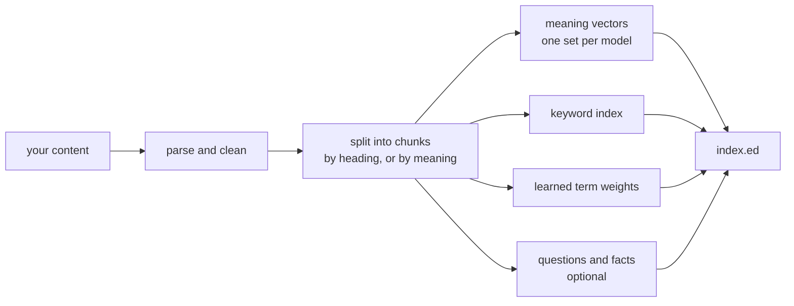
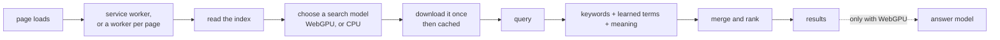

<!-- SPDX-License-Identifier: GPL-3.0-only -->
# Reference

Every command, flag, model and format detail. For a walkthrough, start with
the [user guide](user-guide.md).

## Contents

- [Commands](#commands)
- [Presets](#presets)
- [Title context](#title-context)
- [Indexing built HTML](#indexing-built-html)
- [Recency](#recency)
- [Search models](#search-models)
- [Answer models](#answer-models)
- [Widget attributes](#widget-attributes)
- [Index format](#index-format)

## Commands

```
eddie index  --content-dir <path> --cms <hugo|astro|docusaurus|eleventy|jekyll|mkdocs|html>
             --output <index.ed>
             [--preset fast|balanced|quality|gpu]
             [--dense-model <id>]... [--dense-runtime <spec>]...
             [--sparse | --sparse-model <id>]
             [--device auto|cpu|cuda] [--batch-size 32]
             [--chunk-size 256] [--overlap 32] [--chunk-strategy heading|semantic]
             [--weights D,S,B] [--recency <strength>] [--recency-half-life <days>] [--no-recency]
             [--qa [--qa-subject <name>]] [--claims [--claims-edits <file>]]
             [--bundle-model <lane>] [--no-sidecar-lanes] [--sparse-vocab embed|fetch]
             [--no-title-context] [--no-summary-lane] [--include-noindex]

eddie search --index <index.ed> --query <text>
             [--mode hybrid|dense|sparse|keyword] [--lane <id>] [--top-k 8]
             [--json] [--explain]
             [--weights D,S,B] [--fetch-k N] [--rrf-k K]
             [--recency <strength>] [--recency-half-life <days>]

eddie qa     --index <index.ed> --query <text> [--k 5] [--lane <id>] [--json]

eddie stats  --index <index.ed> [--json]

eddie eval   --index <index.ed> --labels <labels.toml> [--top-k 10] [--mode ...]
             [--weights D,S,B] [--fetch-k N] [--rrf-k K]
             [--recency <strength>] [--recency-half-life <days>]
             [--sweep] [--graded] [--all-modes]

eddie tune   --content-dir <path> --eval <labels.toml> [...]
```

**`index`** reads your content and writes the index file.

**`search`** runs a query against a built index and prints the results. It
reads the models, the learned-term weights and the tokenizer from the index
itself. There is no `--model` flag, so the query and the index can never
disagree about which model to use.

**`qa`** ranks the question-and-answer section the same way the widget's
answer card does, and prints each part of the score.

**`stats`** prints the manifest: the models, the section sizes, the
sidecar files and the identifier the index shares with them.

**`eval`** scores a built index against a labelled query set and reports
Hit@k, MRR and nDCG@k. See [tuning](tuning.md).

**`tune`** sweeps chunk size and overlap, rebuilding and scoring each
combination.

## Presets

`--preset` picks the models and the device in one flag.

| Preset | Search models | Learned terms | Device |
|---|---|---|---|
| `fast` | MiniLM-L6 | no | CPU |
| `balanced` | bge-small-en-v1.5 | yes | CPU |
| `quality` | bge-small-en-v1.5 and Qwen3-Embedding-0.6B | yes | CPU |
| `gpu` | same as `quality` | yes | CUDA |

CUDA indexing is not in the published binaries. Build it yourself with
`cargo build --release --features cuda` against a local CUDA toolkit.

## Title context

Every chunk is indexed under a `{title} — {section}` line, so a query that
names a page finds it even when the body never repeats its own title. The
section is added only when it differs from the title.

Stored text and snippets stay clean. The manifest records `title_context:
true`. `--no-title-context` turns it off, and `eddie search --explain` shows
the prefix each result carried.

## Indexing built HTML

`--cms html` indexes rendered pages instead of source files. Point
`--content-dir` at the build output.

It takes each field from the first source that has it:

| Field | Read from |
|---|---|
| Title | `<meta property="og:title">`, then the first `<h1>`, then `<title>` |
| Description | `<meta name="description">` |
| Date | `<meta property="article:published_time">`, then `<time datetime>` |
| Body | `<main>`, then `<article>`, then `<body>` |

When it falls back to `<body>`, it removes `<nav>`, `<header>`, `<footer>`,
`<aside>` and the Eddie widget first.

It skips `404.html`, `tags/`, `categories/`, `page/N/`, pages marked
`<meta name="robots" content="noindex">`, and pages whose text comes out
under 20 words. `--include-noindex` keeps the `noindex` pages.

This parser does not read dates from most sites, so the recency boost
below has nothing to work with on an HTML-indexed corpus.

## Recency

On a **browse-style** query, a page's score is multiplied by:

```
1 + strength × 0.5 ^ (age_in_days / half_life_days)
```

A page dated as recently as the newest page in your content gets the full
strength. One half-life older gets half of it. A page with no date is never
moved, and the boost only ever lifts a page, never demotes one.

Ages are measured from the newest date in your content rather than from
today's date, so the same index and query always rank the same way.

A **question-style** query gets no boost at all. Eddie treats a query as a
question when it has a question mark, opens with a question word, or runs to
five words or more. The two kinds of query want opposite things: "when did
we launch" has one right answer and it is whichever page states the fact,
however old, while "java" names a topic where the recent page is usually the
better read.

Defaults: strength 0.15, half-life 1460 days. `--no-recency` leaves it out
of the index. `--recency 0` at query time turns it off for that query.
The measurements behind these defaults are in
[the recency review](reviews/2026-09-01-recency-boost.md).

## Search models

A search model turns text into numbers that capture its meaning. Eddie runs
them one of two ways:

- **`wasm-candle`** runs on the CPU inside the WebAssembly module. It works
  in every browser, and takes bert-family models only.
- **`webgpu-onnx`** runs larger models on the graphics card through
  transformers.js. It needs a browser with WebGPU. Without one, Eddie skips
  that model and keyword search still works.

| Model | Runs as | License | Dimensions | Notes |
|---|---|---|---|---|
| `sentence-transformers/multi-qa-MiniLM-L6-cos-v1` | `wasm-candle` | Apache-2.0 | 384 | Default, tuned for search |
| `BAAI/bge-small-en-v1.5` | `wasm-candle` | MIT | 384 | Used by `balanced` and `quality` |
| `Snowflake/snowflake-arctic-embed-s` | `wasm-candle` | Apache-2.0 | 384 | Clear training-data provenance |
| `Qwen/Qwen3-Embedding-0.6B` | `webgpu-onnx` | Apache-2.0 | 1024 | Used by `quality` and `gpu`. 184 ms per query once warm |
| `microsoft/harrier-oss-v1-0.6b` | `webgpu-onnx` | MIT | 1024 | Last-token pooling, 32k context |
| `BAAI/bge-m3` | `webgpu-onnx` | MIT | 1024 | 779 ms per query once warm |

Models are downloaded from HuggingFace when a visitor agrees to them. Eddie
does not redistribute the weights.

`eddie index --bundle-model <lane>` writes a half-precision copy of a
`wasm-candle` model next to your index, so visitors download it from your
site instead of HuggingFace. It halves the download. Check your host's file
size limit first: Cloudflare Pages rejects files over 25 MiB, and these
files are larger than that.

## Answer models

On a browser with WebGPU and at least 1 GiB of buffer capacity, a small
language model can read the top results and write a cited answer. It plans,
searches, optionally reads one page, then answers, with at most four steps.

| `data-agent-model` | Model | Download |
|---|---|---|
| `auto` (default) | Chosen by the graphics card's capacity | 0.4 GB or 1.2 GB |
| `light` | Qwen3.5-0.8B | about 0.4 GB |
| `quality` | Qwen3.5-2B | about 1.2 GB |
| any other value | Used as a WebLLM model id | varies |

Eddie asks before downloading and states the size. The answer cites its
evidence as `[n]`. When the site does not cover the question, it says so
rather than inventing an answer.

The runtime is [WebLLM](https://github.com/mlc-ai/web-llm). On Linux
Chromium with Vulkan and no `shader-f16` support, the half-precision build
fails validation, so Eddie uses the single-precision build there. That
measured 62 tokens per second for the 0.8B model and 52 for the 2B, on an
RTX 4090.

## Widget attributes

The widget reads these from its own `<script>` tag. The common ones are in
the [user guide](user-guide.md#configure-the-widget).

| Attribute | Values | Default |
|---|---|---|
| `data-index-url` | URL | `index.ed` next to the script |
| `data-position` | `top-left`, `top-right`, `bottom-left`, `bottom-right` | `bottom-right` |
| `data-theme` | `light`, `dark`, `auto` | `auto` |
| `data-offset-x`, `data-offset-y` | pixels | `0` |
| `data-top-k` | number | `8` |
| `data-answer-top-k` | number | `5` |
| `data-qa-mode` | `off`, `auto`, `always` | `auto` |
| `data-qa-subject` | text | the site's hostname |
| `data-agent-mode` | `off`, `auto` | `auto` |
| `data-agent-model` | `auto`, `light`, `quality`, model id | `auto` |
| `data-dense-runtime` | `auto`, `wasm`, `webgpu`, `off` | `auto` |
| `data-persist` | `auto`, `off` | `auto` |
| `data-warm` | `auto`, `off`, `always` | `auto` |
| `data-consent-text` | text | built-in wording |
| `data-loader` | `boot`, `full` | `boot` |

Every value you set is a ceiling on what a visitor may choose in the
settings panel.

## How it works in detail

Eddie is one Rust codebase built two ways: a command-line tool that indexes
your content, and a WebAssembly module that searches it in the browser.

### At build time



### In the browser



Where the browser allows it, the engine lives in a service worker scoped to
the asset directory. Moving between pages then keeps the index, the search
model and the answer model loaded, so the second page is ready at once. With
`data-persist="off"`, or where service workers are unavailable, each page
loads its own worker instead.

With `data-warm="auto"`, the engine starts loading right after a page loads,
but only for a visitor who has already agreed to the model and still has it
cached. A first-time visitor downloads nothing until they open search.

[widget/README.md](../widget/README.md) documents the workers, the transport
choice and the message protocol.

## Index format

Format v5. An `SAED` container holds `SAGI` payload sections for chunk
metadata, text, keywords, learned terms, and one or more search models.

Large model sections can live in **sidecar** files named
`index.<model>.ed`, next to the main index. A visitor downloads a sidecar
only if they use that model. `--no-sidecar-lanes` puts everything in one
file.

The main index and its sidecars share an identifier, so a sidecar attaches
only to the index it was built with.

A 0.4 CLI refuses index files from versions 1 to 4 and asks you to rebuild.
There is no in-place upgrade: run `eddie index` again after upgrading.

## Related documents

- [User guide](user-guide.md) — installing, configuring and deploying
- [Tuning](tuning.md) — measuring and improving result quality
- [Benchmarks](benchmarks.md) — how Eddie is measured
- [Widget internals](../widget/README.md) — the browser runtime
