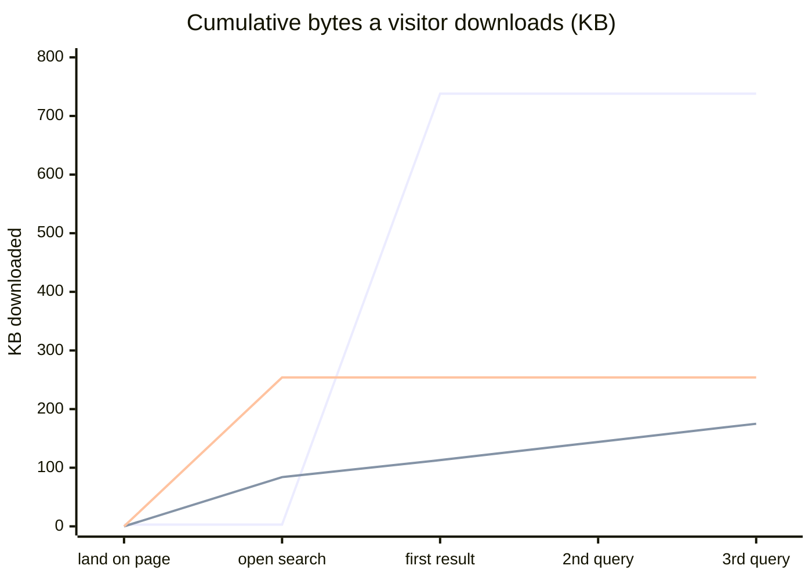

<!-- SPDX-License-Identifier: GPL-3.0-only -->
# Eddie against Pagefind and Orama, on one real site

Date: 2026-09-01. Corpus: www.jason-grey.com, 75 content pages, and the
45 questions in that site's `.eddie/eval.labels.toml`, graded 1 to 3 by
hand before this benchmark was written.

Eddie 0.4.3, Pagefind 1.5.2, Orama 3.1.18.

## Summary

Eddie ranks better on every query shape tested. It also costs a visitor
about six times more to reach a first result than Pagefind does. Both of
those are the same design decision seen from two sides.

## What was compared, and how

All three tools indexed the same site and answered the same 45 questions.
Each returns a ranked list of page URLs, scored by one scorer with one set
of graded judgements.

| | Indexed | Corpus |
|---|---|---|
| Eddie | the markdown in `content/` | 75 pages |
| Pagefind | the built HTML, as it is designed to | 217 pages |
| Orama | text extracted from the same built HTML, taxonomy and pagination pages removed | 81 pages |

Orama has no site-generator integration, so its corpus is a judgement call.
Leaving `/tags/` and `/categories/` in made it noticeably worse, and no
one shipping Orama would leave them in, so they are out.

**Query shape matters more than anything else here**, so all three tools
were run on three forms of the same 45 questions:

| Form | Example |
|---|---|
| Full question | "how long has jason been programming?" |
| Keywords, 5 terms | "jason programming" (stop words and question words dropped) |
| Keywords, 2 terms | "programming" (the two rarest corpus terms in the question) |

The keyword forms are generated mechanically, not hand-picked. They exist
because the first run was unfair: Pagefind matches all terms by default, our
questions average 5 content words, and 18 of 45 queries returned nothing at
all. That is a property of how the query was written, not of Pagefind.

## Result quality

Graded nDCG@10, Hit@10 and MRR over the same 45 questions.

**Full question**

| Tool | Hit@10 | MRR | nDCG@10 |
|---|---:|---:|---:|
| **Eddie** | **0.978** | **0.814** | **0.774** |
| Orama | 0.889 | 0.609 | 0.512 |
| Pagefind | 0.178 | 0.167 | 0.143 |

**Keywords, 5 terms**

| Tool | Hit@10 | MRR | nDCG@10 |
|---|---:|---:|---:|
| **Eddie** | **0.978** | **0.767** | **0.748** |
| Orama | 0.889 | 0.642 | 0.587 |
| Pagefind | 0.422 | 0.333 | 0.293 |

**Keywords, 2 terms**

| Tool | Hit@10 | MRR | nDCG@10 |
|---|---:|---:|---:|
| **Eddie** | **0.889** | **0.713** | **0.644** |
| Orama | 0.644 | 0.486 | 0.418 |
| Pagefind | 0.556 | 0.411 | 0.372 |

Read it this way. The longer and more natural the query, the further ahead
Eddie is: 5.4× Pagefind's nDCG on full questions, 1.7× on two-word queries.
Pagefind is built for short keyword queries and gets better as queries get
shorter, which is exactly what its design predicts.

Eddie's own score falls as queries get shorter, 0.774 to 0.644. Short
one- and two-word queries are its known weak spot, and this measures it.

## What a visitor downloads

Measured in a browser against the same site. Brotli where the server
compresses.

| Step | Eddie | Pagefind | Orama |
|---|---:|---:|---:|
| Land on a page | 3 KB | 0 | 0 |
| Open search | 3 KB | 84 KB | 254 KB |
| First result | **738 KB** | **113 KB** | **254 KB** |
| Second query | 738 KB | 144 KB | 254 KB |
| Third query, another page | 738 KB | 175 KB | 254 KB |

**Pagefind is the cheapest way to a first result, by a factor of six.** It
loads a small engine and then fetches index chunks per query, about 30 KB
each. Eddie loads its engine and whole index once, then answers every later
query and every later page from memory. Pagefind's cumulative total passes
Eddie's after about 21 queries in one session, which almost no visitor does.

Orama must ship its entire index before the first query, because the index
holds the full text of every page. 239 KB brotli here, and that grows
linearly with the site.

Eddie is the only one of the three that costs a visitor who never searches
almost nothing: 3 KB, versus loading the engine on page load.

**The model is not in this chart.** A visitor who accepts Eddie's optional
embedding model downloads 91 MB or 134 MB once, cached afterwards, and is
asked first. That is far larger than anything above. Decline it and Eddie
still runs its keyword and learned-sparse arms, which is where most of its
lead over Pagefind comes from.

## Query latency

| Tool | First query | Later queries |
|---|---:|---:|
| Pagefind | 26 ms | 18 ms |
| Orama | 0.4 ms (in Node, no network) | 0.4 ms |

Eddie's in-browser query latency was not measured here and is deliberately
left blank rather than estimated. Its index and model are resident after the
first search, so no network is involved, but that is an argument, not a
measurement.

## Site generator coverage

| | Eddie | Pagefind | Orama |
|---|---|---|---|
| Approach | Reads the source, or the built HTML | Reads the built HTML | You write the pipeline |
| Hugo | module, plus installer | works | build it |
| Jekyll | gem installer | works | build it |
| Astro | npm installer | works | build it |
| Docusaurus | npm installer | works | build it |
| Eleventy | npm installer | works | build it |
| MkDocs | PyPI installer | works | build it |
| Anything else | `--cms html` | works | build it |

Pagefind's generator-agnostic design is a real advantage. It reads whatever
HTML you produce, so it works on generators nobody has written an installer
for, with no per-tool support burden.

Eddie's source parsers buy it front-matter it cannot get from HTML: dates,
tags, descriptions and explicit titles, which feed chunking, the recency
signal and the answer card. Where that does not apply, `--cms html` puts it
on the same footing as Pagefind.

Orama is a library, not a site search tool. Everything above is something
you build yourself: extraction, chunking, index shipping, the UI.

## Honest limits of this benchmark

- **One site, 75 pages, 45 questions, judged by the author of Eddie.** It
  shows a shape, not a ranking of these projects.
- **The questions were written for Eddie's label set** before this
  comparison, but by the same person. A question set written by a Pagefind
  user would likely be shorter and favour Pagefind.
- **Orama was configured by us**, including the corpus and the field
  boosting (`title` boosted 2×). Someone who knows Orama well would
  probably do better than we did.
- **Orama was run in full-text mode.** Orama also does vector and hybrid
  search, which would close much of the quality gap, at the cost of an
  embedding pipeline and a larger payload. That comparison is the
  interesting one and is not done here.
- Eddie was measured through `eddie eval`, which shares its ranking code
  with the browser build, so the numbers transfer. Pagefind was measured in
  a real browser. Orama was measured in Node.

## Reproducing it

The harness is in `/home/jason/tmp/eddie-bench` on the machine this was run
on, not in the repository: it pulls in Pagefind, Orama, jsdom and a headless
browser, which do not belong in Eddie's dependency tree. The parts worth
keeping are recorded here.
